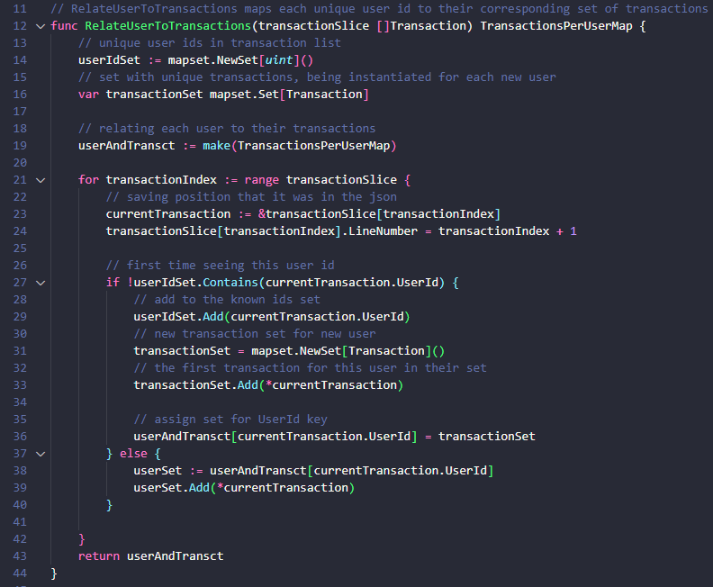

# Risk Assessment API

API designed to assess the risk associated with financial transactions. Utilizing predefined rules, this API evaluates transaction data to determine potential risks and returns comprehensive risk assessments. Developed in Go (Golang) for reliability and scalability.

## Objective
* Create a simple API to process a list of financial transactions and return the associated risk for each, applying the rules described below:

| id | condition | risk |
| --- | --- | --- |
| 1 | transaction amount is more than $5000 | medium |
| 2 | transaction amount is more than $10000 | high |
| 3 | user spend more than $10000 in total | medium |
| 4 | user spend more than $20000 in total | high |
| 5 | user uses more than 1 cards | medium |
| 6 | user users more than 2 cards | high |

* For transactions with multiple matches of rules, the highest risk wins

## How this API works
The code is written in Golang, since it's highly on demand for its capabilities to optmize performance and built-in concurrency support. It's also very simplistic and has many other incredible features. <br>
The external libraries used were: gin-gonic (for server setup), golang-set (to map users to transactions) and testify (for testing)

Code is divided in a straight-forward manner. Domain folder contains a single file with all the type definitions, constants and custom sorting function. Both `go.mod` and `go.sum` are necessary files to manage dependencies. You can find the core logic of the API in `servicefunctions.go`, which contains all the functions definitions. `main.go` sets up the server and make that "bridge" between the logic and the response. Both  `servicefunctions.go` and `main.go` have their equivalent test files, you can see more details in [test coverage section](#test-coverage).
```
└── 📁TransactionRiskAssessment
    └── coverage.out
    └── 📁domain
        └── transaction.go
    └── go.mod
    └── go.sum
    └── main.go
    └── main_test.go
    └── servicefunctions.go
    └── servicefunctions_test.go
    └── README.md
```

To fulfill the API's purpose, first we need to understand what problem will be solved. Transactions sent for the API have the following fields:
```
 "id": Transaction ID
 "user_id": ID of user that made that transaction
 "amount_us_cents": Value spent in this transaction
 "card_id": Card ID to indicate which card was used in this transaction
```

The request to the API should follow this format:
```
{
  "transactions": [
    {// transaction data
    },
    ...
  ]
}
```

Looking closely to the [rule set](#objective) represented above, we can see that only the rules #1 and #2 evaluate the transaction alone, all the others are tied to evaluating the transactions concerning the same user. Also, while investigating the example given, you can see that the output is tied to the input order provided - since the API returns the list with only the assessed risks.

The next step then is representing the transactions in code. This is done by the following code snippet


In addition to the fields provided by the input JSON, we add fields to store the calculated risk for each particular transaction (RiskLevel) and the original line number, ensuring consistency in the analyses and response.

Now, we need to relate the transactions to their user. A hashmap would be perfect so we can acess the transactions using the user id as the key. This is done by `RelateUserToTransaction` function:



The function iterates over the JSON received from the request, creating keys for distinct userIDs and adding the related transactions to a set as the value for the key.

Since we got each user with their transactions, we can apply the rules to evaluate the transactions. To ensure readability and manutenability, each pair of rules was divided in functions, as follows


These functions receive the array (in Golang, slices) for a given user, iterate for each checking the conditions described in the rules set table. After checking the conditions, they update the RiskRate field of the evaluated transaction. Note: they don't update it if the new risk is lower than the current one in the transaction.

To create the JSON response, we have `allTransactionsRisk`, which receives an array with all the transactions, sort them by LineNumber and creates the JSON to be outputted. 


Okay, the logic is almost done! The function that wraps it all and iterates over the map, processing each user is called `CheckTransactions`. Here we get the transactions with their updated risk accordingly, adding them to an array to be processed by `allTransactionsRisk` and return its response.


Now, `main.go` is the responsible for managing the server and receive `POST` requests. `main()` method creates the server and maps `POST` requests to `AssessTransactions` which parses the input JSON to a structure that Go understands, invoking `RelateUserToTransaction` to get the transactions by user and `allTransactionsRisk` to get their risks. Finishing it up parsing the Go structure to JSON and sending as the response.


## Setting up the API


* You'll need golang installed on your machine. To download, go to the URL below and select the version according with your OS:
> https://go.dev/dl/
* After the installation is complete, navigate to the directory containing the code (transactionriskassessment)
> cd [yourpath]\transactionriskassessment
* Let's get the server running: 
> go run .
* This will install the dependencies and launch the API, which will be accessible at `http://localhost:9090`.
* You're ready to Go! ;)


## Using API services 

If you want to get the risk for your transactions, you should format the request this way (using the software of choice to communicate to the API):

#### HTTP Request
```
curl --location --request POST 'http://localhost:9090/check_transactions' \
--header 'User-Agent: Apidog/1.0.0 (https://apidog.com)' \
--header 'Content-Type: application/json' \
--header 'Accept: */*' \
--header 'Host: localhost:9090' \
--header 'Connection: keep-alive' \
--data-raw '{
  "transactions": [
    {"id": 1, "user_id": 1, "amount_us_cents": 200000, "card_id": 1},
    {"id": 2, "user_id": 1, "amount_us_cents": 600000, "card_id": 1},
    {"id": 3, "user_id": 1, "amount_us_cents": 1100000, "card_id": 1},
    {"id": 4, "user_id": 2, "amount_us_cents": 100000, "card_id": 2},
    {"id": 5, "user_id": 2, "amount_us_cents": 100000, "card_id": 3},
    
    {"id": 6, "user_id": 2, "amount_us_cents": 100000, "card_id": 4}
  ]
}'
```

You should get the risks accordingly to each line in the input:

#### API response
```
{
    "risk_ratings": [
        "low",
        "medium",
        "high",
        "low",
        "medium",
        "high"
    ]
}
```
## Test coverage
This API has a 100% code coverage (according to golang test tool) with the unit tests created to ensure reliability for each section of the logic. When running
> go test . -coverprofile=coverage.out

we get: 


To breakdown this value, we run
> go tool cover -func=coverage.out

This way we know which statements are covered by the unit tests


After running the unit tests, integration tests were performed using Apidog to send the requests. An example:


## Future Improvements
- The code currently doesn't handle any errors, but this aspect is identified as an important area for future enhancements.
- To enhance legibility and maintainability, the algorithm currently uses multiple loops to encapsulate each set of rules. While this approach suffices for handling small requests, it introduces unnecessary code complexity, resulting in a time complexity of O(n²). To improve scalability and efficiency, a future enhancement will be refactoring the code to streamline its structure, aiming to reduce the time complexity to O(n) where possible, that way improving the performance and ensuring scalability for larger datasets
- Enhancing API's by incorporating an indicator to denote which transaction has been evaluated, that way eliminates the input order dependency
- Avoid using . (dot) to import type definitions from domain/transactions.go
- Incorporate additional routing or redirection mechanisms to provide informative responses when endpoints other than /check_transactions are accessed
- Incorporate a structured data model to encapsulate rule sets, enabling easy addition and modification of rules, while also permitting tracking of rule matches for each transaction
